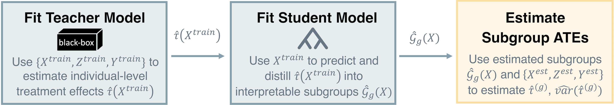

## Overview

In this notebook, we will demonstrate how to use causal machine learning methods to discover, interpret, and evaluate heterogeneous treatment effects (HTEs). We will learn how to:

1.  Fit various popular heterogeneous treatment effect (HTE) models to estimate individual-level treatment effects
2.  Discover and interpret subgroups with heterogeneous treatment effects using Causal Distillation Trees and Causal Rule Ensembles
3.  Evaluate the quality of the heterogeneous treatment effect estimators with diagnostic tools

```{r setup, include=FALSE}
knitr::opts_chunk$set(
  echo = TRUE, 
  warning = FALSE, 
  message = FALSE, 
  error = FALSE, 
  fig.width = 10, 
  fig.height = 8
)
set.seed(331)
here::i_am(file.path("notebooks", "demo.Rmd"))
source(here::here("R", "utils.R"), chdir = TRUE)
```

## Data

For the sake of demonstration, we will be using simulated data, generated as follows:

- We first generate $n = 500$ samples and $p = 10$ covariates from a standard normal distribution $$X \sim N(0, I_p)$$
- We then generate a random binary treatment variable $Z$ with a 50% probability of treatment $$Z \sim \text{Bernoulli}(0.5)$$
- We specify the true heterogeneous treatment effect function as $$\tau(X) = 2 \cdot \mathbb{1}(X_1 > 0) - \mathbb{1}(X_2 > -0.5)$$
  - Thus, throughout this notebook, the true underlying *subgroup structure* is defined by the first two covariates, $X_1$ and $X_2$, and the true underlying *heterogeneous treatment effect function* is a simple step function that takes on four different values depending on the values of $X_1$ and $X_2$, i.e., 
  \begin{align*}
  \tau(X) = 
  \begin{cases}
  2 & \text{if } X_1 > 0 \text{ and } X_2 > -0.5 \\
  1 & \text{if } X_1 > 0 \text{ and } X_2 \leq -0.5 \\
  0 & \text{if } X_1 \leq 0 \text{ and } X_2 \leq -0.5 \\
  -1 & \text{if } X_1 \leq 0 \text{ and } X_2 > -0.5 
  \end{cases}
  \end{align*}
- Finally, we generate the outcome variable Y as $$Y = Z \cdot \tau(X) + \varepsilon,$$ where $\varepsilon \sim N(0, \sigma^2)$ is an independent noise term with standard deviation $\sigma = 0.1$

```{r}
n <- 500
p <- 10
sigma <- 0.1
X <- matrix(rnorm(n * p), nrow = n, ncol = p)
Z <- rbinom(n, 1, 0.5)
tau <- 2 * (X[, 1] > 0) + (-1) * (X[, 2] > -0.5)
Y <- Z * tau + rnorm(n, 0, sigma)
```

```{r, class.source="fold-hide", fig.height=4, fig.width=6}
X_grid <- expand.grid(
  X1 = seq(-3, 3, length.out = 100),
  X2 = seq(-3, 3, length.out = 100)
) |> 
  dplyr::mutate(
    tau = 2 * (X1 > 0) + (-1) * (X2 > -0.5)
  )
ggplot2::ggplot(X_grid) +
  ggplot2::aes(x = X1, y = X2, fill = factor(tau)) +
  ggplot2::geom_tile() +
  ggplot2::scale_fill_manual(
    values = c("salmon1", "grey", "skyblue1", "skyblue3"),
    name = expression(tau(X))
  ) +
  ggplot2::labs(
    title = "True Heterogeneous Treatment Effect Function",
    x = expression(X[1]),
    y = expression(X[2])
  ) +
  ggplot2::coord_cartesian(expand = FALSE) +
  ggplot2::guides(fill = ggplot2::guide_legend(reverse = TRUE)) +
  ggplot2::theme_bw()
```

Before proceeding further, let's split the data into a training set (70%) and a test set (30%). The training set will be used to fit the various HTE models, while the test set will be used to evaluate the quality of the estimated heterogeneous treatment effects.

```{r}
train_idxs <- sample(1:n, size = 0.7 * n, replace = FALSE)
X_train <- X[train_idxs, ]
Z_train <- Z[train_idxs]
Y_train <- Y[train_idxs]
X_test <- X[-train_idxs, ]
Z_test <- Z[-train_idxs]
Y_test <- Y[-train_idxs]
```

## Heterogeneous Treatment Effect Estimation

Using the training data, let's now begin to explore various heterogeneous treatment effect estimation methods. In this notebook, we will focus on three popular metalearners:

- Causal Forest [@wager2018estimation]
- X-learner [@kunzel2019metalearners]
- R-learner [@nie2021quasi]


### {.tabset .unnumbered}

#### Causal Forest

```{r}
cf_out <- grf::causal_forest(X = X_train, Y = Y_train, W = Z_train)
tau_cf <- predict(cf_out)$predictions
```

#### X-Lasso

```{r}
xlasso_out <- rlearner::xlasso(x = X_train, y = Y_train, w = Z_train)
tau_xlasso <- predict(xlasso_out)
```

#### X-Boost

```{r}
xboost_out <- rlearner::xboost(x = X_train, y = Y_train, w = Z_train)
tau_xboost <- predict(xboost_out)
```

#### R-Lasso

```{r}
rlasso_out <- rlearner::rlasso(x = X_train, y = Y_train, w = Z_train)
tau_rlasso <- predict(rlasso_out)
```

#### R-Boost

```{r}
rboost_out <- rlearner::rboost(x = X_train, y = Y_train, w = Z_train)
tau_rboost <- predict(rboost_out)
```

### {.unnumbered}

Let's quickly compare the estimated heterogeneous treatment effects from the different models.

```{r hte-distribution, class.source="fold-hide", fig.cap="Distribution of the estimated heterogeneous treatment effects from different models. The vertical dashed line indicates the estimated average treatment effect (ATE).", fig.height=3}
tau_df <- tibble::tibble(
  `Causal Forest` = tau_cf,
  `X-Lasso` = c(tau_xlasso),
  `X-Boost` = tau_xboost,
  `R-Lasso` = c(tau_rlasso),
  `R-Boost` = tau_rboost
)

tau_df |> 
  tidyr::pivot_longer(
    cols = tidyselect::everything(),
    names_to = "Model",
    values_to = "tau"
  ) |> 
  ggplot2::ggplot() +
  ggplot2::aes(x = tau) +
  ggplot2::facet_wrap(~ Model, nrow = 1, scales = "free_y") +
  ggplot2::geom_histogram(
    color = "grey98", fill = "skyblue3", linewidth = 0.25, bins = 20
  ) +
  ggplot2::labs(
    x = expression(hat(tau)[i]),
    y = "Count"
  ) +
  ggplot2::theme_bw()
```

```{r hte-paired-scatter, class.source="fold-hide", fig.cap="Paired scatter plot of the estimated heterogeneous treatment effects from different models. "}
GGally::ggpairs(tau_df, columns = 1:ncol(tau_df)) +
  ggplot2::theme_bw()
```

These plots reveal that different HTE models can produce very different heterogeneous treatment effect estimates. This is a common phenomenon in practice and highlights the need to both interpret and rigorously evaluate the quality of the estimated heterogeneous treatment effects. Later, we will see how to evaluate the quality of these heterogeneous treatment effect estimators.

## Interpretable Heterogeneous Treatment Effect Estimation

When it comes to discovering interpretable subgroups with heterogeneous treatment effects, there are a variety of methods that have been developed in the literature. Two popular approaches include (i) tree-based methods which output a full partition of the covariate space into different subgroups and (ii) rule-based methods which output a set of if-then rules that define different subgroups.

In what follows, we will focus on one representative method from each of these two categories to demonstrate how to discover and interpret subgroups with heterogeneous treatment effects:

- Causal Distillation Trees (CDT) [@huang2025distilling]: a tree-based method for interpretable subgroup discovery
- Causal Rule Ensembles (CRE) [@bargagli2020causal]: a rule-based method for interpretable subgroup discovery

### Causal Distillation Trees (CDT)

At a high-level, Causal Distillation Trees (CDT) is a two-stage learner that first fits a teacher model (e.g., any black-box metalearner) to estimate individual-level treatment effects and secondly fits a student model (e.g., a decision tree) to predict the estimated individual-level treatment effects, in effect distilling the estimated individual-level treatment effects and producing interpretable subgroups. This two-stage learner is learned using the training data. Finally, using the estimated subgroups, the subgroup average treatment effects are honestly estimated with a held-out estimation set.



**Fitting CDT:**

To fit CDT using a causal forest as the teacher model, we can use the `causalDT` function from the `causalDT` package.

```{r}
cdt_cf <- causalDT::causalDT(
  X = X, Y = Y, Z = Z,
  teacher_model = "causal_forest", 
  rpart_prune = "1se"
)
```

Some notes on the CDT implementation and hyperparameters:

- Since the training-test split happens inside the `causalDT` function, we input the full data (i.e., `X`, `Y`, and `Z`) into the function instead of just the training data. CDT will automatically split the data into a training set and an estimation set based on the specified `holdout_prop` argument.
- By default, CDT will perform a 70-30% training-test split (specified by `holdout_prop = 0.30`), use a causal forest as the teacher model (specified by `teacher_model = "causal_forest"`), and use an ordinary CART as the student model (specified by `student_model = "rpart"`). 
- The `rpart_prune` argument controls the pruning of the student tree. By default, it is set to `"none"` which performs no pruning. This argument can be set to `"min"` or `"1se"` to perform pruning based on the cross-validated error. Setting it to `"min"` selects the tree with the minimum cross-validated error. Setting it to `"1se"` selects the most parsimonious tree within one standard error of the minimum.

**CDT Output:** 

- The estimated subgroups and their corresponding subgroup average treatment effect estimates are stored in the `estimate` element of the CDT output. Below, we extract the `estimate` element and format it into a nice table.

```{r}
cdt_cf$estimate |> 
  dplyr::mutate(
    `Estimated Subgroup ATE` = sprintf("%.2f (%.2f)", estimate, variance)
  ) |> 
  dplyr::select(
    `Subgroup Rule` = subgroup,
    `Treated n` = .n1,
    `Control n` = .n0,
    `Estimated Subgroup ATE`
  ) |> 
  knitr::kable(
    booktabs = TRUE,
    caption = "Estimated subgroup average treatment effects from the Causal Distillation Tree (CDT) model."
  )
```

- To visualize the resulting tree structure, we can use the `plot_cdt` function.

```{r, fig.height=6, fig.width=8}
causalDT::plot_cdt(cdt_cf)
```

**Teacher Model Selection:**

CDT also provides a stability-based model selection procedure to determine which teacher model is most appropriate for the given data. The idea is to choose the teacher model that results in the most stable student trees (i.e., subgroups) across bootstrap resamples. By default, the `causalDT` function will evaluate this stability-based model selection procedure across B = 100 bootstrap resamples (specified by `B_stability = 100`).

To demonstrate how to use this stability-based model selection procedure, let's fit another CDT with a different teacher model (e.g., R-Lasso) and compare the subgroup stability across the two teacher models.

```{r, fig.height=4, fig.width=7}
# selecting between causal forest versus rlasso
cdt_rlasso <- causalDT::causalDT(
  X = X, Y = Y, Z = Z,
  teacher_model = causalDT::rlearner_teacher(rlearner::rlasso)
)
causalDT::plot_jaccard(
  # include any number of CDT objects you want to compare here
  `Causal Forest` = cdt_cf, 
  `R-Lasso` = cdt_rlasso
)
```

Higher Jaccard Subgroup Stability Index (SSI) values indicate more stable subgroup estimation across bootstrap resamples. Generally, we would prefer teacher models that lead to more stable subgroups. In this example, we see that the causal forest teacher model leads to more stable subgroups than the R-Lasso regardless of the subgroup order (i.e., depth of the tree).

Beyond the Jaccard SSI, it can also be informative to examine the distribution of the features that were used to make splits in the trees across bootstrap resamples, as shown below.

```{r, fig.height=5, fig.width=10}
feature_stability_df <- dplyr::bind_rows(
  `Causal Forest` = cdt_cf$stability_diagnostics$feature_distribution,
  `R-Lasso` = cdt_rlasso$stability_diagnostics$feature_distribution,
  .id = "Teacher Model"
)

ggplot2::ggplot(feature_stability_df) +
  ggplot2::aes(
    x = `Teacher Model`, y = freq, fill = feature
  ) +
  ggplot2::geom_bar(stat = "identity", position = "fill") +
  ggplot2::facet_wrap(~ depth, nrow = 1, labeller = ggplot2::label_both) +
  ggplot2::labs(
    y = "Proportion of Splits", fill = "Feature"
  ) +
  ggplot2::theme_classic() +
  ggplot2::theme(
    axis.text.x = ggplot2::element_text(angle = 45, hjust = 1)
  )
```

### Causal Rule Ensembles (CRE)

At a high-level, Causal Rule Ensembles (CRE) [@bargagli2020causal] is a method for decomposing heterogeneous treatment effects into interpretable if-then rules. CRE discovers a set of (possibly overlapping) decision rules that characterize subpopulations with differential treatment effects.

The CRE procedure consists of three main steps:

1. **IATE Estimation**: Individual average treatment effects (IATEs) are estimated using a flexible model (e.g., AIPW, causal forest, BART). The data is split into a discovery set and an inference set via honest splitting.
2. **Rules Generation and Selection**: Candidate decision rules are generated from an ensemble of decision trees fit on the discovery set. These candidate rules are then filtered via stability selection (or other selection methods) to retain only the most stable and informative rules.
3. **Inference**: The selected rules are used to decompose the CATE on the held-out inference set, providing estimates and uncertainty quantification for each subgroup defined by a rule.

**Fitting CRE:**

To fit CRE, we use the `cre` function from the `CRE` package. CRE has two sets of parameters:

- `method_params`: controls the ITE estimation method (e.g., `"aipw"`, `"cf"`, `"bart"`) and the discovery/inference split ratio.
- `hyper_params`: controls the rule generation and selection process, including the number of trees, tree depth, pruning thresholds, and stability selection settings.

```{r}
method_params <- list(
  ratio_dis = 0.5,
  ite_method = "aipw"
)

hyper_params <- list(
  ntrees = 50,
  node_size = 20,
  max_rules = 50,
  max_depth = 3,
  t_decay = 0.025,
  t_corr = 1,
  stability_selection = "vanilla",
  cutoff = 0.9,
  B = 50,
  subsample = 0.5
)

cre_out <- CRE::cre(
  y = Y, z = Z, X = X,
  method_params = method_params,
  hyper_params = hyper_params
)
```

Some notes on the CRE hyperparameters:

- `ntrees` and `node_size` control the ensemble of decision trees used to generate candidate rules. More trees and smaller terminal nodes produce more candidate rules.
- `max_rules` and `max_depth` cap the total number of candidate rules and the maximum rule complexity (number of conditions per rule).
- `t_decay` controls pruning aggressiveness: lower values retain more rules.
- `stability_selection` and `cutoff` control how rules are selected: `"vanilla"` performs standard stability selection, and `cutoff` sets the minimum selection frequency across bootstrap resamples (lower values are more permissive).
- `ite_method = "cf"` uses a causal forest for ITE estimation, which tends to produce richer heterogeneity estimates than the default AIPW.
- See `? CRE::cre` for more details on the available parameters and their effects.

**CRE Output:**

The `summary` function displays the selected rules and their estimated CATE contributions with uncertainty quantification.

```{r}
summary(cre_out)
```

The `plot` function visualizes the CATE decomposition, showing the estimated effect for each selected rule.

```{r}
plot(cre_out)
```

We can also use the fitted CRE model to predict individual treatment effects for new observations.

```{r}
ite_pred <- predict(cre_out, X)
```

## Diagnostic Tools for Evaluating Heterogeneous Treatment Effect Estimates

In this last section, we will briefly introduce two diagnostic tools for evaluating the quality of heterogeneous treatment effect estimators:

- Omnibus Goodness of Fit Test [@chernozhukov2018generic]
- Relative Error Assessment [@gao2025trustworthy]

These diagnostic tools are not meant to be exhaustive, but rather to provide a starting point for thinking about how to evaluate the quality of heterogeneous treatment effect estimates in practice. 

### Omnibus Goodness of Fit Test {.tabset}

To perform the omnibus goodness of fit test, we can use one of our helper functions, `omnibus_test()`, which implements the test proposed by @chernozhukov2018generic. This omnibus test requires the following inputs:

- `Y`: the observed outcome variable
- `Yhat`: the predicted outcome variable from the model
- `Z`: the observed treatment variable
- `phat`: the predicted propensity score from the model
- `tauhat`: the predicted heterogeneous treatment effect from the model

If the coefficient corresponding to `differential.prediction` is significantly greater than 0, then the model's predicted CATEs are a good fit for the data. Otherwise, the model is likely not a good fit for the data.

#### Causal Forest

```{r}
# get predicted treatment effects
cf_tauhat <- predict(cf_out, X_test)$predictions

# get estimated propensity scores
cf_Z <- grf::regression_forest(X_train, Z_train)
cf_phat <- predict(cf_Z, X_test)$predictions

# get estimated responses
cf_Y <- grf::regression_forest(X_train, Y_train)
cf_Yhat <- predict(cf_Y, X_test)$predictions

# conduct gof test
cf_omnibus <- omnibus_test(
  Y = Y_test,
  Yhat = cf_Yhat,
  Z = Z_test,
  phat = cf_phat,
  tauhat = cf_tauhat
)
cf_omnibus
```

#### R-Lasso

```{r}
# get predicted treatment effects
rlasso_tauhat <- predict(rlasso_out, X_test)

# get estimated propensity scores
w_fit <- rlasso_out$w_fit
w_lambda_min <- w_fit$lambda[which.min(w_fit$cvm[!is.na(colSums(w_fit$fit.preval))])]
rlasso_phat <- predict(w_fit, X_test, s = w_lambda_min, type = "response")

# get estimated responses
y_fit <- rlasso_out$y_fit
y_lambda_min <- y_fit$lambda[which.min(y_fit$cvm[!is.na(colSums(y_fit$fit.preval))])]
rlasso_mhat <- predict(y_fit, X_test, s = y_lambda_min)

# conduct gof test
rlasso_omnibus <- omnibus_test(
  Y = Y_test, 
  Yhat = ifelse(
    Z_test == 1, 
    rlasso_mhat - rlasso_tauhat, 
    rlasso_mhat
  ),
  Z = Z_test,
  phat = rlasso_phat,
  tauhat = rlasso_tauhat
)
rlasso_omnibus
```


### Relative Error Assessment

To evaluate the relative error of the estimated heterogeneous treatment effects, we can use one of our helper functions, `relative_error()`, which implements the relative error assessment framework proposed by @gao2025trustworthy. This relative error assessment requires the following inputs:

- `X`, `Y`, and `Z`: the observed covariates, outcome variable, and treatment variable, respectively
- `tauhat`: the predicted heterogeneous treatment effect from the model being evaluated
- `tauhat_ref`: the predicted heterogeneous treatment effect from a reference model
- `muhat1` and `muhat0`: the predicted potential outcomes under treatment and control, respectively, from the model being evaluated
- `phat`: the predicted propensity score from the model being evaluated

```{r}
rel_error_out <- relative_error(
  X = X_test,
  Y = Y_test,
  Z = Z_test,
  tauhat = cf_tauhat,
  tauhat_ref = rlasso_tauhat,
  muhat1 = cf_Yhat + (1 - cf_phat) * cf_tauhat,
  muhat0 = cf_Yhat - cf_phat * cf_tauhat,
  phat = cf_phat
)

rel_error_out
```

```{r}
# 95% confidence interval for the relative error
lower_bound <- rel_error_out$rel_error - qnorm(0.975) * rel_error_out$se
upper_bound <- rel_error_out$rel_error + qnorm(0.975) * rel_error_out$se
print(paste0(
  "95% Confidence Interval for Relative Error: [",
  round(lower_bound, 3), ", ", round(upper_bound, 3), "]"
))
```

If the confidence interval lies to the left of 0, then the model being evaluated has a smaller error than the reference model. If the confidence interval lies to the right of 0, then the model being evaluated has a larger error than the reference model. If the confidence interval contains 0, then we cannot conclude that there is a significant difference in error between the model being evaluated and the reference model.

In this case, since the confidence interval lies to the left of 0, there is sufficient evidence to suggest that the causal forest is a better fit for the data than the R-Lasso.

## References
